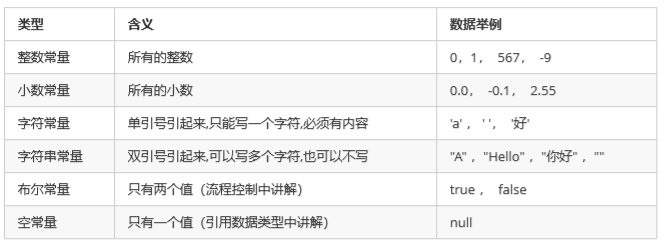
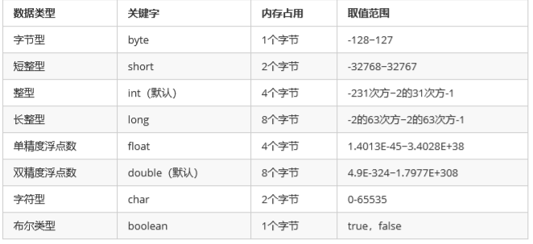
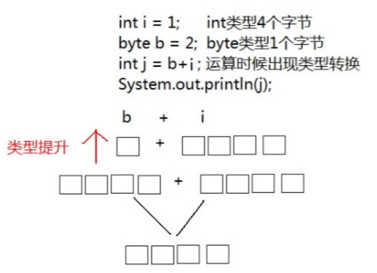
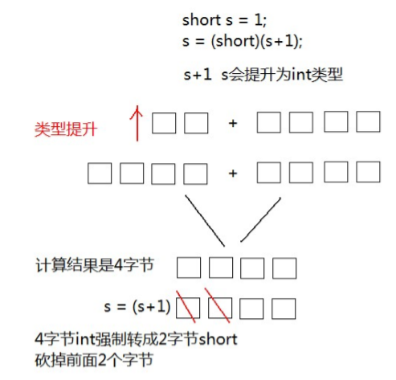
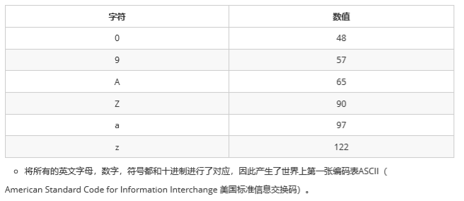

# 变量
	
变量：常量是固定不变的数据，那么在程序中可以变化的量称为变量

Java中要求一个变量每次只能保存一个数据，必须要明确保存的数据类型

变量注意事项：

- 变量作用域：在同一个大括号范围内，变量的名字不可相同
- 变量赋值：定义的变量，不赋值不能使用

#常量

常量：是指Java程序中固定不变的数据

分类：



# 数据类型

分类：
	- 基本数据类型：包括整数、浮点数、字符、布尔值
	- 引用数据类型：类、数组、接口



## 自动类型转换

java程序要求参与计算的数据，必须保证数据的一致性，如果数据类型不一致将发生类型的转换

- 自动类型转换：将取值范围小的类型自动提升为取值范围大的类型



注意：当byte、short、char运算时会自动提升为int类型

转化规则：
	
	byte、short、char --> int --> long --> double
	
- 强制类型转换：将取值范围大的类型自动提升为取值范围小的类型



转化格式：
	
	数据类型 变量名 = （数据类型）被转数据

可能会出现的精度丢失：

(1) 浮点数转换成整数，直接取消小数点，可能造成数据损失精度

(2) int 强制转换成 short 会砍掉2个字节，可能会造成数据丢失

## ASCII编码集
	
编码集：将文字和一个十进制数对应起来组成一张表格
	


注意：在char类型和int类型计算的过程中，char类型的字符先查询编码集，得到97
再和1求和，结果为98。char类型提升为int类型，char类型内存2个字节，int类型内存4个字节

#包装类

##概述

Java提供了两个类型系统，基本类型与引用类型，使用基本类型在于效率，然而很多情况，会创建对象使用，因为对象可以做更多的功能，如果想要我们的基本类型像对象一样操作，就可以使用基本类型对应的包装类，如下：

| 基本类型    | 对应的包装类（位于java.lang包中） |
| ------- | --------------------- |
| byte    | Byte                  |
| short   | Short                 |
| int     | **Integer**           |
| long    | Long                  |
| float   | Float                 |
| double  | Double                |
| char    | **Character**         |
| boolean | Boolean               |

##装箱与拆箱

基本类型与对应的包装类对象之间，来回转换的过程称为”装箱“与”拆箱“：

* **装箱**：从基本类型转换为对应的包装类对象。

* **拆箱**：从包装类对象转换为对应的基本类型。

用Integer与 int为例：（看懂代码即可）

基本数值---->包装对象

~~~java
// Integer i = new Integer(4); // 使用构造函数函数
// Integer iii = Integer.valueOf(4); // 使用包装类中的valueOf方法
~~~

包装对象---->基本数值

~~~java
//int num = i.intValue();
~~~
##自动装箱与自动拆箱

由于我们经常要做基本类型与包装类之间的转换，从Java 5（JDK 1.5）开始，基本类型与包装类的装箱、拆箱动作可以自动完成。例如：

```java
// Integer i = 4;	// 自动装箱。相当于Integer i = Integer.valueOf(4);
// i = i + 5;	 // 等号右边：将i对象转成基本数值(自动拆箱) i.intValue() + 5;
		// 加法运算完成后，再次装箱，把基本数值转成对象。
```

##基本类型与字符串之间的转换

   基本类型转换String总共有三种方式，查看课后资料可以得知，这里只讲最简单的一种方式： 

~~~
基本类型直接与””相连接即可；如：34+""
~~~

String转换成对应的基本类型 

除了Character类之外，其他所有包装类都具有parseXxx静态方法可以将字符串参数转换为对应的基本类型：

- `public static byte parseByte(String s)`：将字符串参数转换为对应的byte基本类型。
- `public static short parseShort(String s)`：将字符串参数转换为对应的short基本类型。
- `public static int parseInt(String s)`：将字符串参数转换为对应的int基本类型。
- `public static long parseLong(String s)`：将字符串参数转换为对应的long基本类型。
- `public static float parseFloat(String s)`：将字符串参数转换为对应的float基本类型。
- `public static double parseDouble(String s)`：将字符串参数转换为对应的double基本类型。
- `public static boolean parseBoolean(String s)`：将字符串参数转换为对应的boolean基本类型。

代码使用（仅以Integer类的静态方法parseXxx为例）如：

```java
public class Demo18WrapperParse {
    public static void main(String[] args) {
        int num = Integer.parseInt("100");
    }
}
```

> 注意:如果字符串参数的内容无法正确转换为对应的基本类型，则会抛出`java.lang.NumberFormatException`异常。
>


	

