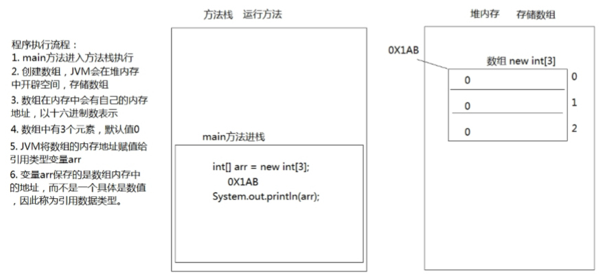
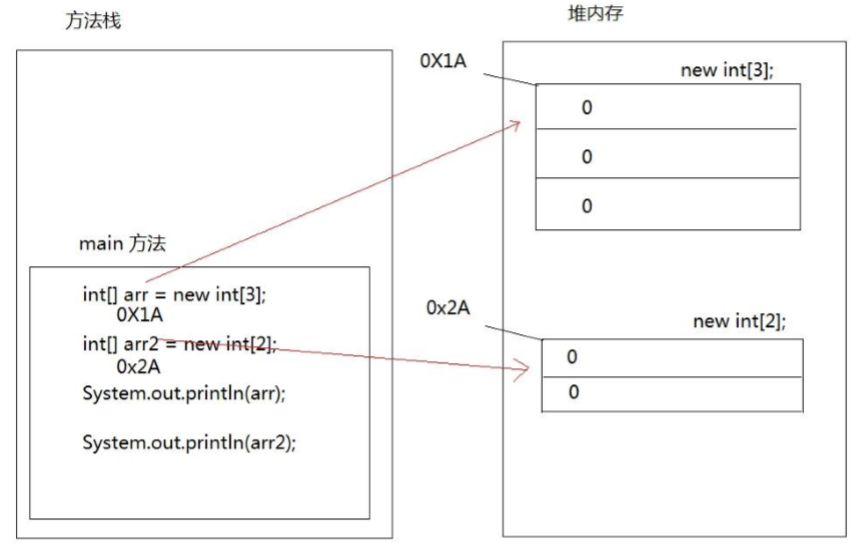
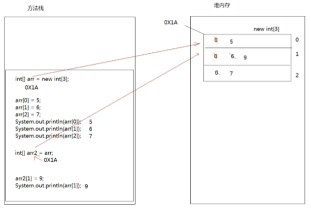
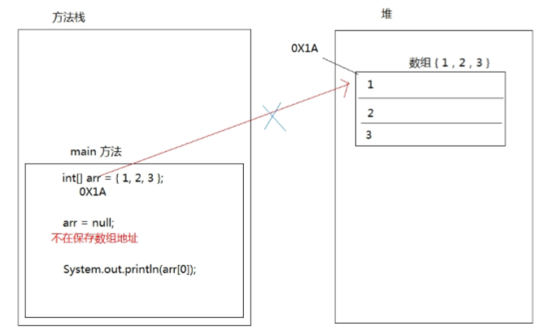

# 数组定义和访问 

## 容器与数组概述 

容器：是将多个数据存储到一起，每个数据称为该容器的元素。
 
数组概念： 数组就是存储数据长度固定的容器，保证多个数据的数据类型要一致。

## 数组的定义

方式一

- 格式

		数组存储的数据类型[] 数组名字 = new 数组存储的数据类型[长度];
		
		定义可以存储3个整数的数组容器，代码如下：
			int[] arr = new int[3];
		
- 数组格式定义详解

		- 数组存储的数据类型： 创建的数组容器可以存储什么数据类型。 
		- [] : 表示数组。 
		- 数组名字：为定义的数组起个变量名，满足标识符规范，可以使用名字操作数组。 
		- new：关键字，创建数组使用的关键字。 
		- 数组存储的数据类型： 创建的数组容器可以存储什么数据类型。 
		- [长度]：数组的长度，表示数组容器中可以存储多少个元素。
		
	注意：数组有定长特性，长度一旦指定，不可更改。 

方式二
	
- 格式

		数据类型[] 数组名 = new 数据类型[]{元素1,元素2,元素3...};
		定义存储1，2，3，4，5整数的数组容器:
		   int[] arr = new int[]{1, 2, 3, 4};

方式三
	
- 格式
		
		数据类型[] 数组名 = {元素1,元素2,元素3...};
		定义存储1，2，3，4，5整数的数组容器
			int[] arr = {1, 2, 3, 4, 5};

## 数组的访问
	
- 索引： 每一个存储到数组的元素，都会自动的拥有一个编号，从0开始，
这个自动编号称为数组索引 (index)，可以通过数组的索引访问到数组中的元素。 

- 格式
	
		数组名[索引]

- 数组的长度属性：每个数组都具有长度，而且是固定的，Java中赋予了数组的一个属性，
可以获取到数组的 长度，语句为：数组名.length ，属性length的执行结果是数组的长度，
int类型结果。由次可以推断出，数组的最大索引值为 数组名.length-1 。

		public static void main(String[] args) {    
			int[] arr = new int[]{1,2,3,4,5};       
			//打印数组的属性，输出结果是5      
			System.out.println(arr.length);    
		}
	

- 索引访问数组中的元素： 

	数组名[索引]=数值，为数组中的元素赋值
	 
	变量=数组名[索引]，获取出数组中的元素
	
		public static void main(String[] args) {     
			//定义存储int类型数组，赋值元素1，2，3，4，5     
			int[] arr = {1,2,3,4,5};     
			//为0索引元素赋值为6     
			arr[0] = 6;     
			//获取数组0索引上的元素     
			int i = arr[0];     
			System.out.println(i);     
			//直接输出数组0索引元素     
			System.out.println(arr[0]); 
		}

# 数组原理内存图

## 内存概述

内存是计算机中的重要原件，临时存储区域，作用是运行程序。我们编写的程序是存放在硬盘中的，
在硬盘中的程 序是不会运行的，必须放进内存中才能运行，运行完毕后会清空内存。

Java虚拟机要运行程序，必须要对内存进行空间的分配和管理

## Java虚拟机的内存划分

为了提高运算效率，就对空间进行了不同区域的划分，因为每一片区域都有特定的处理数据方式和内存管理方式。

JVM的内存划分：

## 数组在内存中的存储

一个数组的内存图

	public static void main(String[] args) {    
		int[] arr = new int[3];       
		System.out.println(arr);//[I@5f150435    
	} 
 
以上方法执行，输出的结果是[I@5f150435，这个是什么呢？是数组在内存中的地址。new出来的内容，都是在堆内存中存储的，
而方法中的变量arr保存的是数组的地址。 输出arr[0]，就会输出arr保存的内存地址中数组中0索引上的元素

两个数组内存图
 
	 public static void main(String[] args) {     
		int[] arr = new int[3];     
		int[] arr2 = new int[2];     
		System.out.println(arr);     
		System.out.println(arr2); 
	} 

两个变量指向一个数组
 
第三章 数组的常见操作 3.1 数组越界异常 
观察一下代码，运行后会出现什么结果。

	public static void main(String[] args) {     
		// 定义数组，存储3个元素     
		int[] arr = new int[3];     
		//数组索引进行赋值     
		arr[0] = 5;     
		arr[1] = 6;     
		arr[2] = 7;     
		//输出3个索引上的元素值     
		System.out.println(arr[0]);     
		System.out.println(arr[1]);     
		System.out.println(arr[2]);     
		//定义数组变量arr2，将arr的地址赋值给arr2     
		int[] arr2 = arr;     
		arr2[1] = 9;     
		System.out.println(arr[1]); 
	} 

# 数组的常见操作

## 数组的两大异常

- 越界异常ArrayIndexOutOfBoundsException

		public static void main(String[] args) {     
			int[] arr = {1,2,3};     
			System.out.println(arr[3]); 
		}
		
创建数组，赋值3个元素，数组的索引就是0，1，2，没有3索引，因此我们不能访问数组中不存在的索引，
程序运 行后，将会抛出 ArrayIndexOutOfBoundsException 数组越界异常。

- 数组空指针异常NullPointerException

		public static void main(String[] args) {     
			int[] arr = {1,2,3};     
			arr = null;     
			System.out.println(arr[0]); 
		}

arr = null 这行代码，意味着变量arr将不会在保存数组的内存地址，也就不允许再操作数组了，
因此运行的时候 会抛出 NullPointerException 空指针异常。

## 数组的遍历

数组遍历： 就是将数组中的每个元素分别获取出来，就是遍历。遍历也是数组操作中的基石。

	
	public static void main(String[] args) {     
		int[] arr = { 1, 2, 3, 4, 5 };     
		System.out.println(arr[0]);     
		System.out.println(arr[1]);     
		System.out.println(arr[2]);     
		System.out.println(arr[3]);     
		System.out.println(arr[4]); 
	}

以上代码是可以将数组中每个元素全部遍历出来，但是如果数组元素非常多，这种写法肯定不行，
因此我们需要改 造成循环的写法。数组的索引是 0 到 lenght-1 ，可以作为循环的条件出现
	
	public static void main(String[] args) {     
		int[] arr = { 1, 2, 3, 4, 5 };     
		for (int i = 0; i < arr.length; i++) {       
			System.out.println(arr[i]);     
		} 
	}

## 数组获取最大值元素

最大值获取：从数组的所有元素中找出最大值。 

实现思路： 

- 定义变量，保存数组0索引上的元素 
- 遍历数组，获取出数组中的每个元素 
- 将遍历到的元素和保存数组0索引上值的变量进行比较 
- 如果数组元素的值大于了变量的值，变量记录住新的值 
- 数组循环遍历结束，变量保存的就是数组中的最大值

		public static void main(String[] args) {     
		  int[] arr = { 5, 15, 2000, 10000, 100, 4000 };     
		  //定义变量，保存数组中0索引的元素     
		  int max = arr[0];     
		  //遍历数组，取出每个元素     
		  for (int i = 0; i < arr.length; i++) {       
		    //遍历到的元素和变量max比较       
		    //如果数组元素大于max       
		    if (arr[i] > max) {        
		    //max记录住大值         
		    max = arr[i];       
		    }     
		  }    
		  System.out.println("数组最大值是： " + max); 
		}

