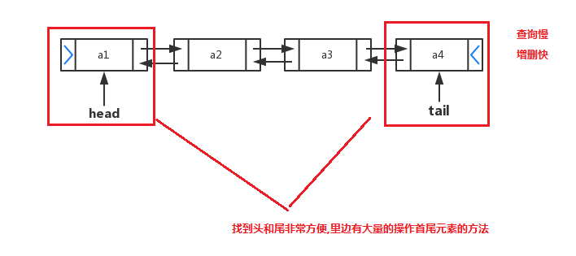

## List 集合概述
`java.util.List`继承继承自Collection接口，是单列集合一个重要的分支，习惯性地会实现了
List接口对象称为"List集合"，特点：
- 在List集合中允许出现重复的元素
- 所有的元素都以一种线性的方式进行存储的
- 在程序中可以通过索引来访问集合中的指定元素
- 元素有序，即元素的存入顺序和取出顺序一致

## List 接口中常用的方法	
List接口作为Collection集合的子接口，不但继承了Collection接口中的全部方法，而且
还增加了一些根据元素索引来操作集合的特有方法

- `public void add(int index, E element)` 将指定的元素，添加到集合中的指定位置上
- `public E get(int index)` 返回集合中指定位置的元素
- `public E remove(int index)` 移除列表中指定位置的元素，返回的是被移除的元素
- `public E set(int index, E element)` 用指定的元素替换集合中指定位置的元素，返回值更新前的元素

[List特有方法案例.java](./java/Demo01_List.java)

## List 的子类

#### ArrayList 集合
java.util.ArrayList集合数据存储的结构是"数组"，元素增删快，查找快，由于日常开发使用最多的
功能便是查询数据和遍历数据，索引使用ArrayList是最常用的集合

#### LinkedList 集合
java.util.LinkedList集合数据存储的是"链表"结构，方便元素的添加、删除的集合

实际开发中对一个集合元素的添加和删除经常涉及到首位操作，而LinkedList提供了大量的首尾操作：
- public void addFirst(E e) 将指定的元素插入到此列表的开头
- public void addLast(E e) 将指定的元素插入到此列表的末尾
- public E getFirst() 返回此列表的第一个元素
- public E getLast() 返回此列表的最后一个元素
- public E removeFirst() 移除并返回此列表的第一个元素
- public E removeLast() 移除并返回此列表的最后一个元素
- public E pop() 从此列表所表示的堆栈弹出一个元素
- public void push(E e) 将元素推入到此列表所表示的堆栈
- public boolean isEmpty() 如果此列表不包含元素，则返回true

[LinkedList首位操作方法案例](java/linkedList/Demo01_LinkedList.java)

#### Vector 集合
Vector类可以实现可增长的对象数组，与数组一样，包含了可以使用整数索引进行访问的组件，
Vector的大小可以根据需要增大或索引，以适应创建Vector后进行添加和移除项的操作

Vector是同步的，可用于多线程；

### 附录：ArrayList源代码分析
- ArrayList 基于数组实现，所以支持快速随机访问
ArrayList 接口标识着该类支持快速随机访问
	
- ArrayList 序列化：
ArrayList 基于数组实现，并且具有动态扩容特性，因此保存元素的数组不一定会被使用，
那么就没必要全部序列化
可见 elementData 属性，它作为真正存放元素的数组，被 transient 无需序列化关键字标识
			
- ArryList的内部实现的数组默认长度为10
源码中 DEFAULT_CAPACITY 属性赋值为10，代表着其默认长度为10
		
- ArrayList使用着一个缓存的数组作为真正存放数组对象的属性
源码中 transient Object[] = elementData 
被 transient 关键字标识着不参与序列化，这是一个运行时属性
		
- ArrayList有三个构造方法
public ArrayList() 默认无参构造，它将调用数组的默认长度10
public ArrayList(int initialCapacity) 设置初始长度的构造方法，
应每次大概的设置其长度，避免ArryaList经常被扩容操作
public ArrayList(collection<? extends E> c) 基于传入集合的元素的构造器
		
- ArrayList 的继承父类 AbstractList 中有一个记录操作数的属性 modCount
即 protected transient int modCount = 0;
该属性用于记录集合被操作了多少次
modCount 用于记录 ArrayList 结构发生变化的次数，此处的结构改变指
添加和删除至少一个元素的所有操作，或者是调整内部数组的大小，仅仅设置元素的值不算结构变化

		