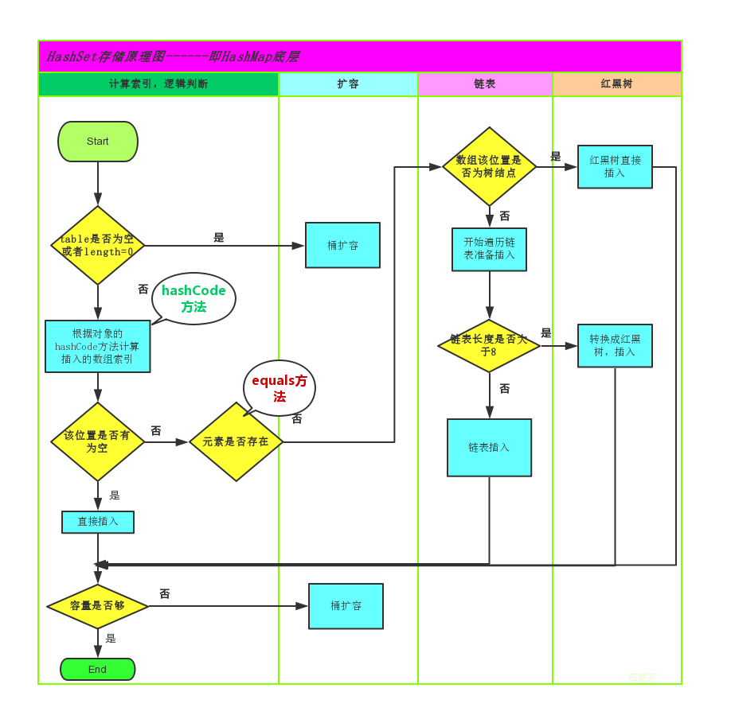
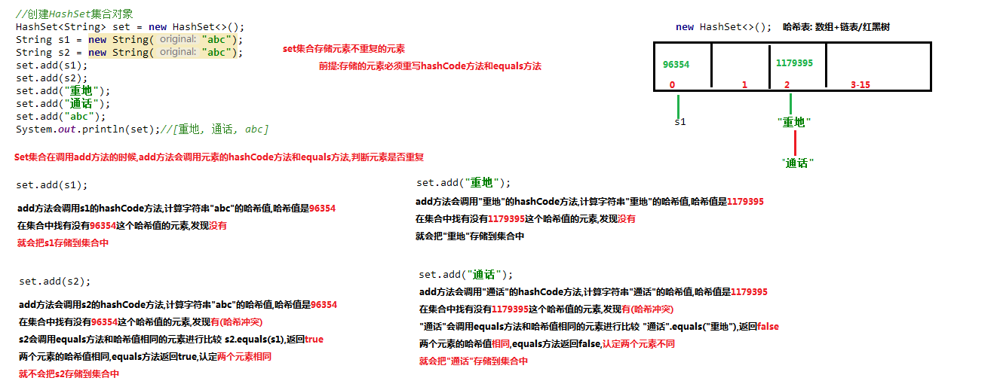
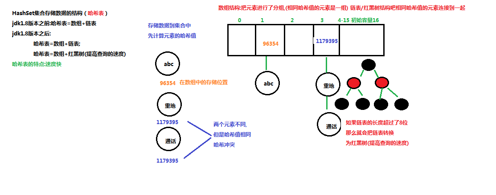

# HashSet集合介绍

java.util.HashSet是Set接口的一个实现类，它所存储的元素是不可重复的，并且
元素都是无序的(即存取顺序不一致)；

java.util.HashSet底层实现其实是一个java.util.HashMap支持；

HashSet是根据对象的“哈希值”来确定元素在集合中的存储位置，因此具有良好的存取和查找性能

Set集合要保证元素的唯一性，需要元素对象实现“hashCode()”和“equals()”方法

Set接口的特点：
 *  1.不允许存储重复的元素
 *  2.没有索引，没有带索引的方法，也不能使用普通的for循环遍历，只能用迭代器
 *  3.是一个无序的集合，存储元素和取出元素的顺序可能不一致
 *  4.底层是一个哈希表结构(查询速度非常快)

[Set接口实现HashSet类的使用.java](./Set/java/Demo01_Set.java)

# 哈希码值
哈希值：是一个十进制的整数，由系统随机给出(就是对象的地址值，是一个逻辑地址，是模拟出来得到的地址，不是数据实际存储的物理地址)在Object类中

有一个方法，可以获取对象的哈希码值
	
	int hashCode() 返回该对象的哈希码值

hashCode()方法的源码：
	
	public native int hashCode();
    native：代表着该方法调用的是本地操作系统的方法
    
[hashCode的测试.java](./Set/java/Demo01_HashCode.java)

# HashSet集合存储数据的结构(哈希表)

哈希表：在JDK1.8之前，哈希表底层采用了“数组+链表”组成，即使用链表处理冲突，同一hash值的链表都存储在
一个链表里。但是当一个集合的元素较多时，即hash值相等的元素较多时，通过key值依次查找的效率较低，而JDK1.8中
哈希表采用了“数组+链表+红黑树”组成，当链表长度超过了阈值(8)时，会将链表转换为红黑树，这样就大大减少了查找时间；
	

存储流程：

总之而言，JDK1.8引入红黑树大程度优化了HashMap的性能，那么对于我们来讲保证HashSet集合元素的唯一性，其实是根据
对象的HashCode()和equals()方法来决定的，如果我们往集合中存放自定义的对象，那么保证其唯一，就必须复写hashCode()
和equals()方法建立当前对象的比较方式；

[HashSet集合存储数据的不重复性测试.java](./Set/java/Demo02_Set.java)

# HashSet存储自定义类型的元素

给HashSet中存放自定义类型元素时，需要重写对象中hashCode()和equals()方法，建立自己比较方式，
才能保证HashSet集合中的对象唯一性；

[自定义类是否重写hashCode()和equals()方法的比较.java](./Set/java/Demo03_Set.java)

# LinkedHashSet

我们知道HashSet保证了元素的唯一性，可是元素存放进去是没有顺序的，那么我们要保证有序，该怎么办？
在HashSet下面有一个子类java.util.LinkedHashSet，它是链表和哈希表组合的一个数据存储结构

[LinkedHashSet与HashSet的比较测试.java](./Set/java/Demo04_Set.java)

