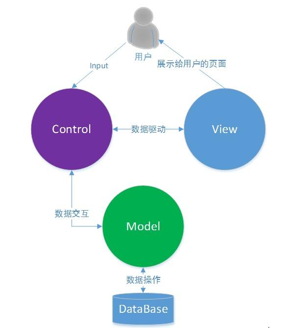

# SpringMVC 的面试题汇总

- 什么是MVC模式？
- 什么是 Spring MVC 框架？
- 什么是 DispatcherServlet ？
- 什么是 Spring MVC 框架的控制器？
- 什么是 WebApplicationContext？
- @Controller 注解
- @RequestMapping 注解
- Spring MVC 的流程
- Spring MVC的优点
- Spring MVC的异常处理
- SpringMVC的控制器是不是单例模式

## 什么是MVC模式？

MVC (Model View Controller) 是一个设计模式，使用 MVC 应用程序被分成三个核心部件：模型、视
图、控制器。它们各自处理自己的任务。M 是指数据模型，V 是指用户界面，C 则是控制器。使用
MVC 的目的是将 M 和 V 的实现代码分离，从而使同一个程序可以应用于不同的表现形式：

- Model：封装了所有的商业逻辑以及规则。通常被 JavaBean 或 EJB 实现。
- View：使用商业逻辑处理后的结果并构建呈现给客户端的响应。通常被 JSP 实现。
- Controller：管理和控制所有用户和应用程序间的交互。通常是一个 Servlet 接收用户的请求并把所有的输入转交给实际工作的 Model。最后调用 JSP 返回输出。

MVC 模式的好处：
- 各司其职，互不干涉，在 MVC 模式中，三个层各司其职，所以如果一旦哪一层的需求发生了变化，就只需要更改相应的层中的代码而不会影响到其他层中的代码。
- 有利于开发中的分工在 MVC 模式中，如果按层把系统分开，那么就能更好地实现开发中的分工。网页设计人员可以进行开发视图层中，对业务熟悉的开发人员可开发业务层，而其他开发人员可开发控制层。
- 有利于组件的重用分层后更有利于组件的重用。如控制层可独立成一个能用的组件，视图层也可做成通用的操作界面。Struts 和 SpringMVC 就是一个基于 MVC 模式的框架。

## 什么是 Spring MVC 框架？

Spring 框架既可与其他第三方 MVC 框架（如 Struts 2）整合，也可直接使用 Spring 本身提供的 Spring
MVC 框架。因此 Spring MVC 就是一个类似于 Struts 2 的 MVC 框架。

## 什么是 DispatcherServlet ？

DispatcherServlet 是 Spring MVC 框架的核心控制器，Spring MVC 框架用它来处理所有的 HTTP 请求，DispatcherServlet 收到用户请求之后，再将用户请求转发给特定的业务控制器。

## 什么是 Spring MVC 框架的控制器？

Spring MVC 框架的控制器由 2 部分组成：

- 核心控制器：由于 Spring 的 DispatchServlet 代表前端控制器
- 业务控制器：由于开发者自己编写的业务控制器代表，该业务控制器需要使用 `@Controller` 修饰，

处理方法通常会使用@RequestMapping 等注解修饰。

## 什么是 WebApplicationContext？

WebApplicationContext 是 ApplicationContext 的子接口，主要适合在 Web 应用中使用。
WebApplicationContext 在 ApplicationContext 基础上增加了 getServletContext()方法，该方法可获取它所在的 ServletContext 对象（application 对象）。
在 Web 应用中使用 WebApplicationContext 时，通常每个 Web 应用都对应一个 root 容器，而应用中其他 Bean 组件（包括 DispatchServlet）可能都在自己的子容器。

## @Controller 注解？
Spring MVC 使用 @Controller 修饰控制器类。

## @RequestMapping 注解？
Spring MVC 使用@RequestMapping 注解修饰控制器的处理方法，该注解用于将处理方法映射到特定
URL。与该注解类似的，Spring 还提供了@PostMapping 、@PutMapping、@DeleteMapping 、@PatchMapping 和@RequestMapping 等注解

## Spring MVC 的流程？

1. 浏览器发送请求至核心控制器：DispatcherServlet。
2. DispatcherServlet 收到请求调用映射处理器（HandlerMapping）处理请求和业务控制器。
3. 映射处理器根据请求 URL 找到对应的业务控制器、创建业务控制器实例以及业务控制器的拦截器
（如果有则创建），然后一并返回给 DispatcherServlet。
4. 执行业务控制器（也就是使用@Controller 修饰的组件）。
5. Controller 执行完成后将结果封装在 ModelAndView 中，然后将 ModelAndView 返回该
DispatcherServlet。
6. DispatcherServlet 将 ModelAndView 传给视图解析器（ViewReslover）。
7. 视图解析器（ViewReslover）解析后返回具体的视图页面。
8. DispatcherServlet 将数据模型传入视图页面，调用视图页面对浏览器生成响应。

## Spring MVC的优点？
1. 可以支持各种视图技术，而不仅仅局限于JSP
2. 与Spring框架集成（如IOC容器，AOP等）
3. 清晰的角色分配：前端控制器（DispatcherServlet），处理器映射器（HandlerMapping），处理器适配器（HandlerAdapter），视图解析器（ViewResolver）
4. 支持各种请求支援的映射策略

## SpringMVC的异常处理?
可以将异常抛给Spring框架，由Spring框架来处理；我们只需要配置简单的异常处理器，在异常处理器中添加视图页面即可

## SpringMVC的控制器是不是单例模式,如果是,有什么问题,怎么解决？
是单例模式，所以在多线程访问的时候有线程安全问题，不要用同步，会影响性能的，解决方案是在控制器里面不能写字段
