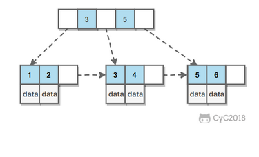
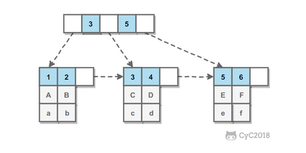

#B+ Tree

## B+ Tree 原理
	
B Tree 指的是 Balance Tree，也就是平衡树，平衡树是一颗查找树，并且所有叶子节点位于同一层；
	
B+ Tree 是基于 B Tree 和叶子节点顺序访问指针进行实现，它具有 B Tree 的平衡性，并且通过
顺序访问指针来提高区间查询的性能；
		
在 B+ Tree 中，一个节点中的 key 从左到右非递减排序，如果某个指针的左右相邻 key 分别是 key(i) 和 key(i+1)，
且不为null，则指针指向节点的所有 key 大于等于 key(i) 且小于 key(i+1)
		

## B+ Tree 操作

进行查找操作时，首先会根节点进行二分查找(顺序存储可用)，找到一个 key 所在的指针，然后递归地在指针所指向的节点进行查找。
直到查找到叶子节点，然后在叶子节点上进行二分查找，找到 key 所对应的 data;
		
插入删除操作会破坏平衡树的平衡性，因此在插入删除操作之后，需要对树进行一个分裂、合并、旋转等操作来维护平衡性；
	
##与红黑树的比较

红黑树等平衡树也可以用来实现索引，但是文件系统及数据库系统普遍采用 B+ Tree 作为索引结构，主要有以下两个原因：
	
- 更少的查找次数

	平衡树查找操作的时间复杂度和树高 h 相关，O(h)=O(logdN)，其中 d 为每个节点的出度。
	红黑树的出度为 2，而 B+ Tree 的出度一般都非常大，所以红黑树的树高 h 很明显比 B+ Tree 大非常多，查找的次数也就更多。
		
- 利用磁盘预读特性

	为了减少磁盘 I/O 操作，磁盘往往不是严格按需读取，而是每次都会预读。预读过程中，磁盘进行顺序读取，
	顺序读取不需要进行磁盘寻道，并且只需要很短的磁盘旋转时间，速度会非常快。
	操作系统一般将内存和磁盘分割成固定大小的块，每一块称为一页，内存与磁盘以页为单位交换数据。数据库系统将
	索引的一个节点的大小设置为页的大小，使得一次 I/O 就能完全载入一个节点。并且可以利用预读特性，相邻的节点也能够被预先载入。
			
## MySQL索引
	
索引时在`存储引擎层`实现的，而不是在服务层实现的，所以不同的存储引擎具有不同的索引类型和实现；
	
- B+ Tree 索引
		
	是大多数 MySQL 存储引擎的默认索引类型；
	因为不需要进行全表扫描，只需要对树进行搜索即可，所以查找速度快很多；
		
	因为 B+ Tree 的有序性，所以除了用于查找，还可以用于排序和分组；
		
	可以指定多个列作为索引列，多个索引列共同组成键；
		
	适用于全键值、键值范围和键前缀查找，其中键前缀只适用于最左前缀查找，如果不是按照索引列的顺序进行查找，则无法使用索引；
		
	InnoDB 的 B+ Tree 索引分为主索引和辅助索引。主索引的叶子节点 data 域记录着完整的数据记录，这种索引称为"聚簇索引"。
	因为无法把数据行存放在两个不同的地方，所以一个表只能由一个"聚簇索引";
		
	
		
	辅助索引的叶子节点的 data 域记录着主键的值，因此在使用赋值索引进行查找时，需要先找到主键值，然后再到主索引中进行查找；
		
- 哈希索引
  
	哈希索引能以 O(1) 时间进行查找，但是失去了有序性：
  
	无法用于排序与分组；
  只支持精确查找，无法用于部分查找和范围查找。
  
  InnoDB 存储引擎有一个特殊的功能叫`自适应哈希索引`，当某个索引值被使用的非常频繁时，会在 B+Tree 索引之上再创建一个哈希索引，
   这样就让 B+Tree 索引具有哈希索引的一些优点，比如快速的哈希查找。
   
- 全文索引
  
	MyISAM 存储引擎支持全文索引，用于查找文本中的关键词，而不是直接比较是否相等。
	  
	查找条件使用 MATCH AGAINST，而不是普通的 WHERE。
	  
	全文索引使用倒排索引实现，它记录着关键词到其所在文档的映射。
	  
	InnoDB 存储引擎在 MySQL 5.6.4 版本中也开始支持全文索引。
	 
- 空间数据索引
  
	  MyISAM 存储引擎支持空间数据索引（R-Tree），可以用于地理数据存储。空间数据索引会从所有维度来索引数据，可以有效地使用任意维度来进行组合查询。
	  
	  必须使用 GIS 相关的函数来维护数据。
		
# 索引的优点
	
- 大大减少了服务器需要扫描的数据行数
- 帮助服务器避免进行排序和分组，以及避免创建临时表
- 将随机 I/O 变为顺序 I/O (B+ Tree 索引是有序的，会将相邻的数据都存储在一起)	
	
# 索引的使用条件
	
- 1.对于非常小的表、大部分情况下简单的全表扫描比建立索引更高效；
- 2.对于中到大型的表，索引就非常有效
- 3.但是对于特大型的表，建立和维护索引的代价会随之增长，这种情况下，需要用到一种技术可以
		区分出需要查询的一组数据，而是一条一条记录地匹配，例如使用分区技术；
	
	
	
	
	
	
	
	
	
	